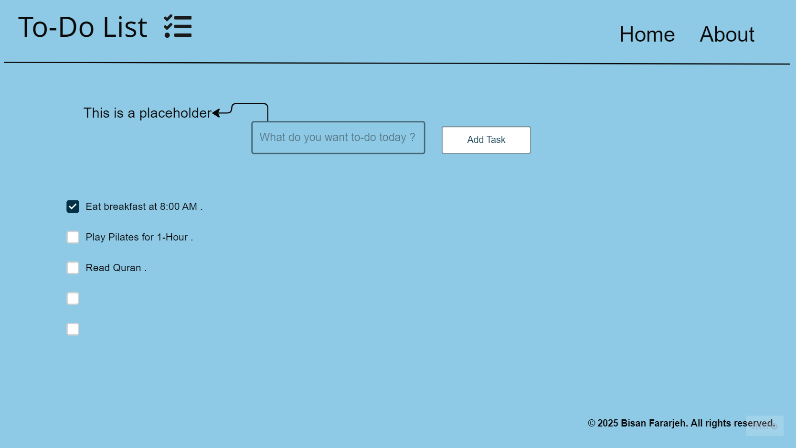
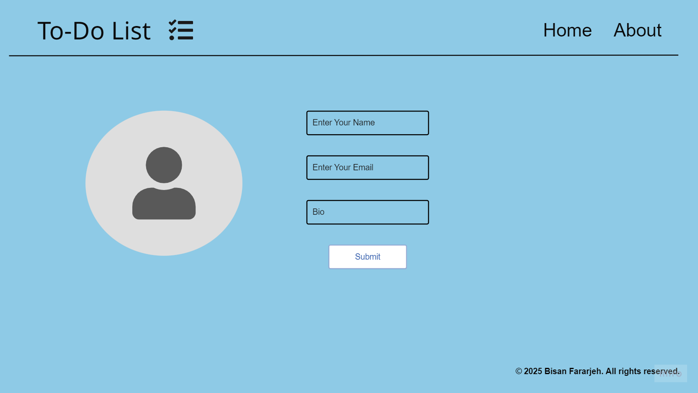
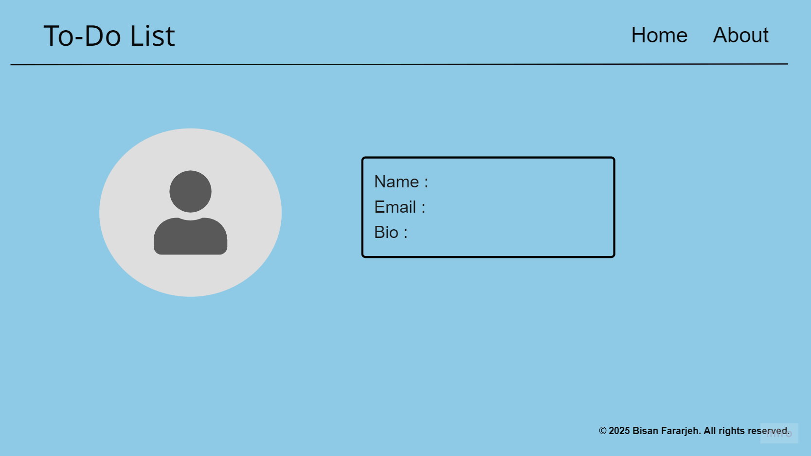

# My-Tasks

### Wireframe :

#### What observations or questions do you have about what you've learned so far?
#### yes , How can I apply what I have done using JavaScript ?

#### How long did it take you to complete this assignment? And how long did you expect it to take?
#### 10-Hours , actullay I think it will take a full day (24-Hours) .